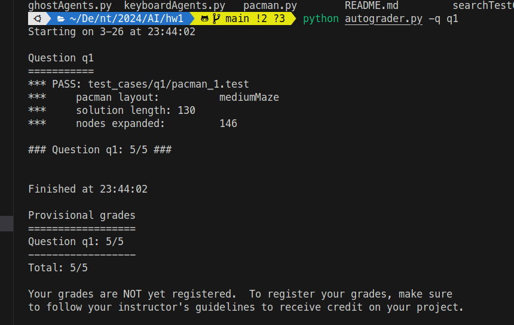
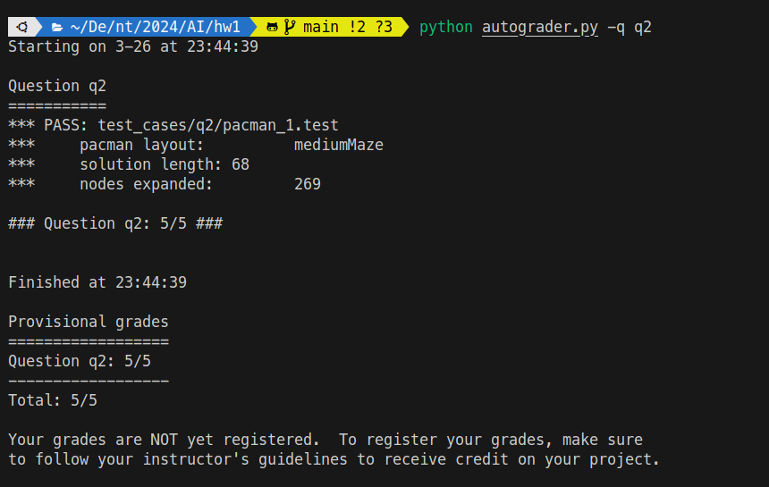
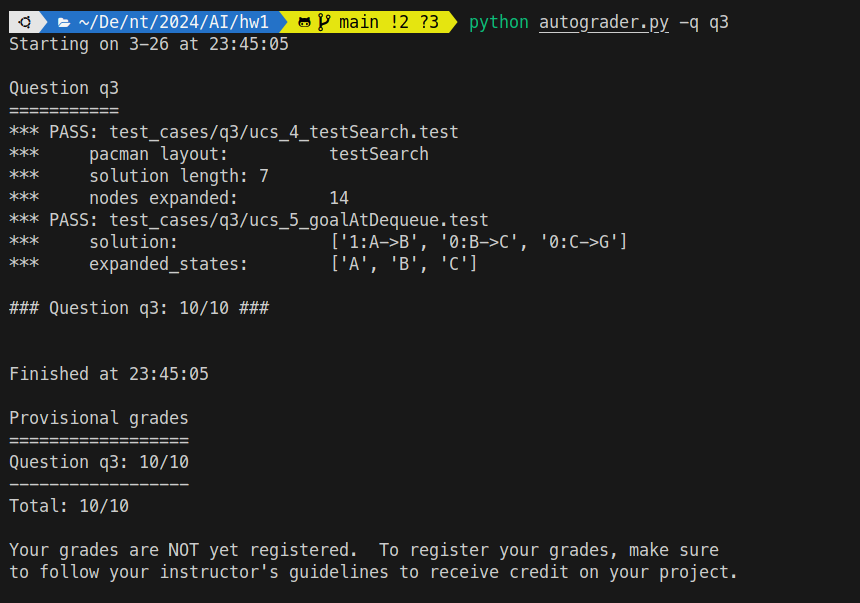
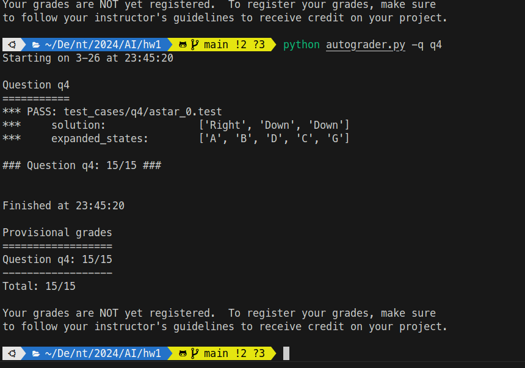
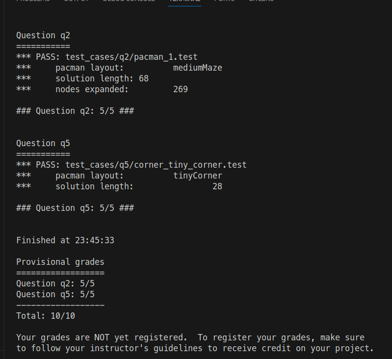
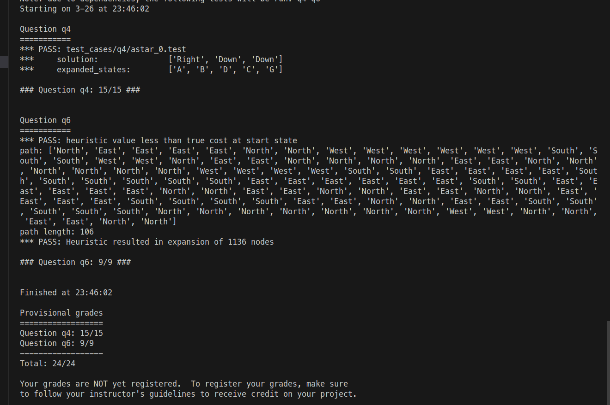

#### ntu 2024spring AI hw1 
##### R12922146 侯善融

## Show your autograder results and describe each algorithm:
### Q1. Depth First Search (1%)

dfs with a stack to record the path, if there is any valid successor, push into stack, otherwise, backtrace to next valid successor in the stack.

### Q2. Breadth First Search (1%)

just a simple bfs strategy

### Q3. Uniform Cost Search (1%)

While p_queue is not empty, do the following:
1. Pop the state with the lowest cost from p_queue.
2. If the popped state is a goal state, terminate the search.
3. Otherwise, for each successor of the current state:
4. If the successor state hasn't been visited, update its cost and add it to p_queue.
5. Update the path information for the successor if a shorter path is found.
6. Backtrack from the goal state to the start state to find the optimal path.

### Q4. A* Search (null Heuristic) (1%)

While fringe is not empty, do the following:
1. Pop a node from the fringe. This node contains information about the current location, the path taken to reach it, and the cumulative cost.
2. If the current location has not been visited:
3. Mark the current location as visited.
4. For each successor of the current location:
   1. If the successor has not been visited:
   2. cost to reach the successor = cost of reaching the current node + the cost of the action leading to the successor.
5. Calculate the priority of the successor by adding the cost to reach the successor and the heuristic estimate of the remaining cost from the successor to the goal.
Push the successor onto the fringe with its calculated priority.

### Q5. Breadth First Search (Finding all the Corners) (1%)

Base on last algo, but calculate the manhattanDistance to the corner and choose the minimal cost one 

### Q6. A* Search (Corners Problem: Heuristic) (1%)

## Describe the difference between Uniform Cost Search and A* Contours (2%)
Uniform-cost expands equally in all “directions”
A* expands mainly toward the goal, but does hedge its bets to ensure optimality
## Describe the idea of Admissibility Heuristic (2%)
Admissible (optimistic) heuristics slow down bad plans but never outweigh true costs