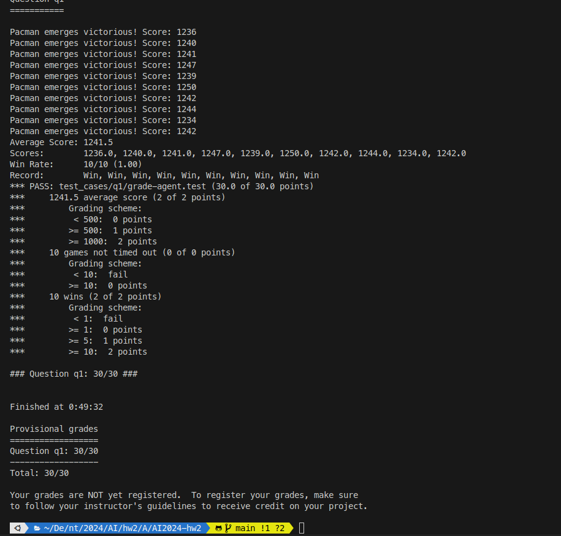
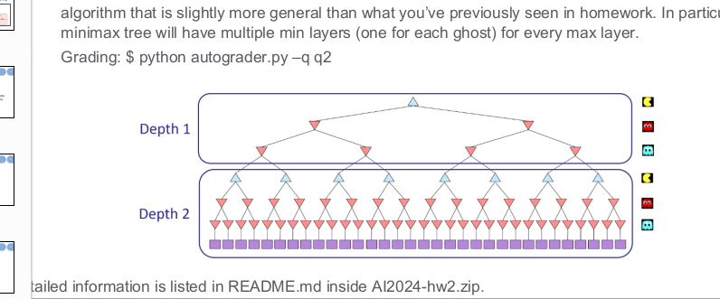
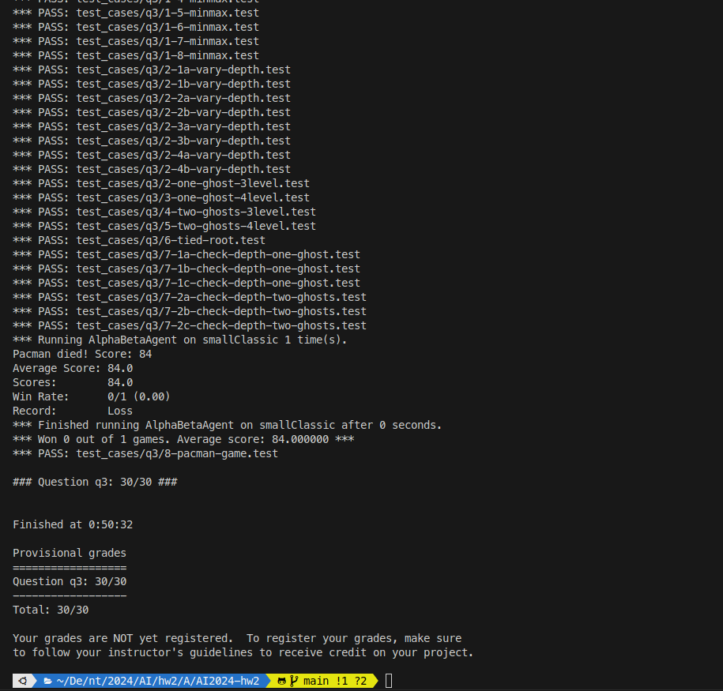

#### ntu 2024spring AI hw2 
##### R12922146 侯善融

## Show your autograder results and describe each algorithm:
### Q1. Reflex Agent (2%)

find the closest food also avoid from ghost if ghost is too close. 
return reciprocal the closest if the ghost isn't too close, in this way, pacman can simply find the food.

### Q2. Minimax (2%)

build the minmax as picture in AI2024-hw2.pdf

### Q3. Alpha-Beta Pruning (2%)

build the minmax as picture in AI2024-hw2.pdf
add the alpha-beta Pruning as 

## Describe the idea of your design about evaluation function in Q1
Just simply move toward the food with shortest manhattanDistance.
if the ghost is next to the pacman, return -1 to avoid pacman kill itself.

## Demonstrate the speed up after the implementation of pruning.