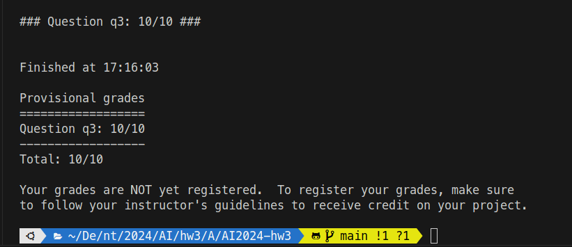

#### ntu 2024spring AI hw2 
##### R12922146 侯善融

## Show your autograder results and describe each algorithm:
### Q1 – Logic Warm-up (2%)
simply finish the question as it described.

### Q2 – Logic Workout (2%)
simply finish the question as it described.

### Q3 – Pacphysics and Satisfiability (2%)
simply finish the question as it described.

### Q4 – Path Planning with Logic (2%)
append all the state (x,y) that pacman can be. add into to KB as the problem mentioned.
Construct the model using the findModel

### Q5 – Eating All the Food (2%)\
1. change gx, gy into g and treat every food as (gx, gy)
2. In the final, Construct the three sentences with proper operators and append them to the the knowledge base

## Questions According to Lecture
### Q1. 
儘管LLM在語言相關任務上表現出色，包括文字生成、理解和翻譯。但AGI應該包含更廣泛的能力範圍，包括感知、推理、規劃和與真實世界的互動。
### Q2. 
(1) 基於文本與圖像之間的關聯性，通過在事件中心化的結構化數據中提取關鍵信息，生成對應的文本描述。
(2) 正樣本：對於每個事件中心化的結構化數據，將其生成的文本描述視為正樣本。然後，尋找與該文本描述相關聯的圖像
(3) 負樣本：對於每個事件描述，隨機選擇與其不相關聯的其他圖像。這些圖像被視為負樣本。

### Q3. 

1. when confronted with ambiguous category names, models frequently struggle to make accurate judgments regarding the corresponding visual concepts, leading to underwhelming performance.

2. Steps to generate the structured graph-based data in this work: 
	(1) Given a specific category, 
	(2) feed hand-crafted instructions into LLMs, 
	(3) generate human-like category-related descriptions
	(4) feed the descriptions into LLMs to generate structured graphs

### Q4. 
"Apple pie is a baked dish with a golden brown crust, filled with sweet apple slices, and often served with vanilla ice cream." 	

Baklava is a sweet pastry with layers of phyllo dough, chopped nuts, and honey or syrup. It has a distinctive diamond shape and is often garnished with pistachios.

### Q5. 
人類擁有更多的semantic knowledge, 像是情感和情緒等，有時候對於input具有更重要的意義，另外，文化差異與文化背景也會對整體意義上又很大的影響，因此將這些也納入考量是極為重要的