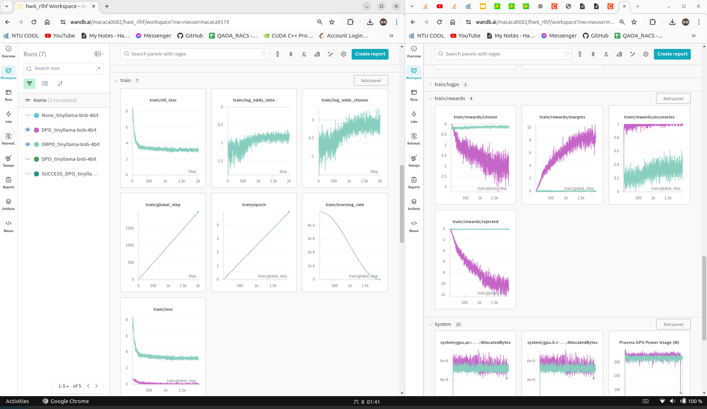

ntu 2024spring AI hw6
===
**R12922146 侯善融**
## 1. Provide a brief description and comparison of DPO and ORPO.

|   | DPO | ORPO |
| -------- | :--------: | :--------: | 
| 描述 | DPO 是根據用戶偏好數據直接對模型進行優化的方法。它不依賴傳統的損失函數，而是通過比較多個選項之間的偏好來調整模型，使其更符合用戶的期望     | ORPO 利用賠率比的概念，根據用戶偏好數據對模型進行優化。它通過計算不同選項之間的相對賠率，來調整模型參數，使模型更好地反映用戶的偏好     | 
| 優點 | 直接使用偏好數據，簡化了優化過程,並且可以在沒有明確的Reward Model情況下進行優化。 | 考慮了選項之間的相對偏好，可能更精確地反映用戶需求，在處理不平衡數據方面有優勢。 | 
| 缺點 | 對偏好數據的quality敏感，噪音數據可能影響模型性能，因此需要大量high qulity數據。 | 需要計算賠率比，可能增加計算複雜度，仍然需要大量high qulity數據。 | 

## 2. Briefly describe LoRA
LoRA 不需要更新大模型的所有參數，而是引入少量可訓練的low-rank approximation parameters。這些參數會被訓練來適應特定任務所需的變化，與傳統的微調方法相比，顯著減少了計算和內存開銷。這種方法可以讓模型更快速地適應新任務，同時保持高性能。
pic/Screenshot from 2024-06-08 01-41-34.png

## 3. Plot your training curve by W&B, including both loss and rewards

## 4. Comparison and analysis of results (before & after DPO & after ORPO) (5%)
the accuracy of DPO reaches a better place than ORPO.
